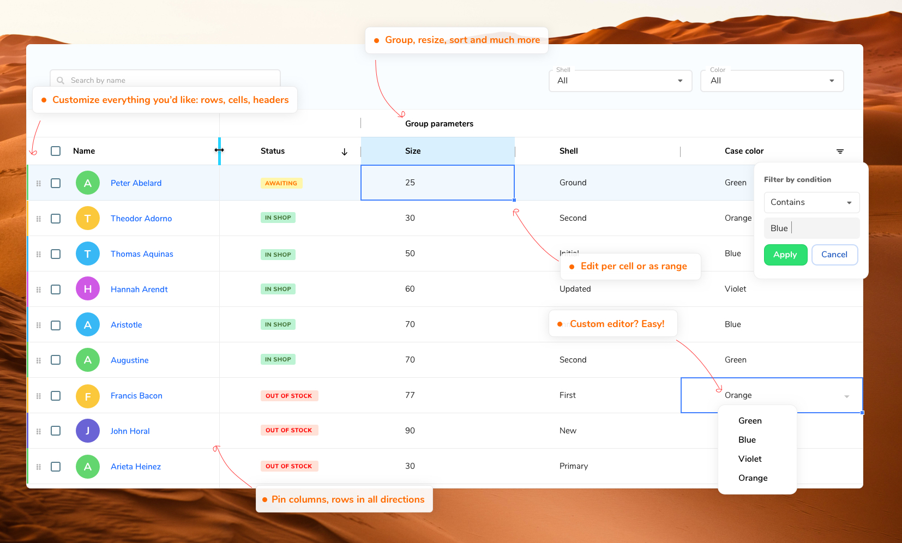

<p align="center">
  <a href="https://rv-grid.com">
    
  </a>
</p>

<p align="center">
  <a href="https://www.npmjs.com/package/@revolist/revogrid"></a>
  <a href="https://github.com/revolist/revogrid/blob/master/LICENSE"></a>
  
  
</p>

#

<h3 align="center">Powerful data grid component built with <a href="https://stenciljs.com" target="_blank">StencilJS</a>.</h3>
<p align="center">
Support Millions of cells and thousands of columns easy and efficiently for fast data rendering. Easy to use.
  
</p>

<p align="center">
  <a href="https://rv-grid.com">Demo and API</a> •
  <a href="#key-features">Key Features</a> •
  <a href="#basic-usage">How To Use</a> •
  <a href="#installation">Installation</a> •
  <a href="https://github.com/revolist/revogrid/blob/master/src/components/revo-grid/readme.md">Docs</a> •
  <a href="#license">License</a>
</p>


<i>RevoGrid material theme.</i>
<br>

## Key Features

- **High Performance**: Handles millions of cells in the viewport with a powerful core built by default.

- **Keyboard Support**:
  - Excel-like focus for efficient navigation and editing.
  - Seamless copy/paste from Excel, Google Sheets, or any other sheet format.


- **Lightweight**: Minimal initial bundle size . Can be imported with polyfills or as a module for modern browsers.

- **Intelligent Virtual DOM**: Smart row recombination to minimize redraws.

- **Sorting**: Multiple options, customizable per column, with advanced event handling.

- **Filtering**:
  - Predefined system filters.
  - Preserve existing collections.
  - Custom filters to extend system filters with your own set.

- **Export**: Export data to file.

- **Custom Sizes**: Define custom sizes for columns and rows. Automatic sizing based on content.

- **Column Resizing**: Adjust column widths.

- **Pinned/Sticky/Freezed Elements**:
  - Columns (define left or right).
  - Rows (define top or bottom).

- **Grouping**:
  - Column grouping (nested headers).
  - Row grouping (nested rows).

- **Cell Editing**: In-place editing of cell data.

- **Customizations**:
  - Column header template.
  - Row header template.
  - Cell template (create your own cell views).
  - Cell editor (use predefined or apply your own custom editors and cell types).
  - Cell properties (define custom properties for rendered cells).

- **Column Types**: [More details](https://rv-grid.com/guide/column/#Column-Formats)
  - Text/String (default).
  - Number.
  - Select.
  - Date.
  - Custom (create extended styles using any template).

- **Drag and Drop**: Easily reorder rows.

- **Range Operations**:
  - Selection.
  - Editing.

- **Theme Packages**:
  - Excel-like (default).
  - Material (compact, dark, or light).

- **Extensibility**: Modern VNode features and tsx support for easy extension.

- **Trimmed Rows**: Hide rows on demand.

- **Plugin System**: Create custom plugins or extend existing ones easily.

- **Additional Customizations and Improvements**: Explore hundreds of other small customizations and improvements in [RevoGrid](https://rv-grid.com/).

<br>


### Usage Vue 2 [Example](https://codesandbox.io/s/data-vue-test-3wkzi?file=/src/App.vue)

With NPM:

```bash
npm i @revolist/vue-datagrid --save;
```

With Yarn:

```bash
yarn add @revolist/vue-datagrid;
```

```vue
// App.vue

<template>
  <!-- Use the VGrid component and bind the data source and columns -->
  <v-grid :source="rows" :columns="columns" />
</template>

<script>
import Grid, { VGridVueTemplate } from '@revolist/vue-datagrid'; // Import the VGrid component
import Cell from './Cell.vue'; // Custom cell template

export default {
  name: 'App',
  data() {
    return {
      // Define the columns for the grid
      columns: [
        { prop: 'name', name: 'First' }, // Simple column definition
        { prop: 'details', cellTemplate: VGridVueTemplate(Cell) }, // Another column definition
      ],
      // Define the data source for the grid
      rows: [{ name: '1', details: 'Item 1' }],
    };
  },
  components: {
    VGrid, // Register the VGrid component
  },
};
</script>
```
```vue
// Cell.vue
<template>Custom cell</template>
<script>
import Vue, { PropType } from 'vue';
export default {
  props: ['prop', 'model', 'column', 'rowIndex', 'colIndex', 'colType', 'type', 'data'],
};
</script>
```


## Versions

- **2.0+**: Introduced the plugin system, grouping, sorting, and filtering.
- **3.0+**: Breaking changes introduced. See the [migration guide](./docs/guide/migration.md).
This version features new component loading, ESM modules, Bootstrap support, and much [more](./docs/guide/migration.md).
- **4.0+**: Breaking changes introduced. See the [migration guide](./docs/guide/migration.md). In this version, we rethought our framework approach, updated typings, fixed major issues, updated core and significantly improved overall performance. The grid is now much faster, with better plugin support and full framework support for Angular, React, and Vue, along with partial support for Ember and Svelte. Redesigned the documentation, and added more examples.


## Sponsors

We would like to extend our heartfelt gratitude to our sponsor for their generous support. Their contributions help us maintain and develop RevoGrid, ensuring continuous improvements and updates. If you are using RevoGrid in your project and would like to support its development, consider becoming a sponsor.

### Our Sponsors

[](https://altruistiq.com)


### Become a Sponsor

If you or your company would like to support the ongoing development of RevoGrid, please consider becoming a sponsor. Your support will help us continue to improve the project and provide the best possible tool for the community.

[](https://opencollective.com/revogrid)

Thank you for supporting RevoGrid! 🙏

## Contributing

We invite you to join our vibrant community and contribute to the growth and success of RevoGrid. By getting involved, you'll have the opportunity to enhance your skills, gain valuable experience, and make a significant impact on an innovative project.

### Why Contribute?

- **Expand Your Knowledge**: Working on RevoGrid allows you to dive deep into modern web technologies, improve your coding skills, and learn best practices in performance optimization, data handling, and component-based architecture.
- **Valuable Experience**: Contributing to an open-source project like RevoGrid provides you with practical experience that can be a great addition to your portfolio. It demonstrates your ability to work collaboratively, solve complex problems, and contribute to a project's success.
- **Professional Growth**: By contributing, you become part of a network of talented developers. This can lead to mentorship opportunities, collaborations, and professional connections that can benefit your career.
- **Make a Difference**: Your contributions can help improve RevoGrid, making it more powerful and user-friendly for developers around the world. Your input can shape the future of the project and drive innovation.

### Join Us

Your contribution, no matter how big or small, is valuable. By working on RevoGrid, you'll be part of an exciting project that's making a difference in the world of data grids. Join us today and let's build something amazing together!

## License

MIT

---

